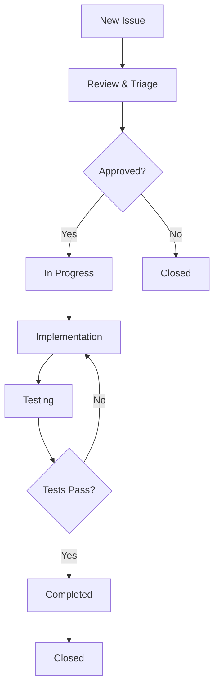

# 🐙 GitHub Integration Guide

*คู่มือการใช้งาน GitHub Issues สำหรับ Feature Requests และ Bug Reports*

---

## 📋 GitHub Issues Overview

### 🎯 วัตถุประสงค์
ใช้ **GitHub Issues** เป็นเครื่องมือหลักในการ:
1. **Feature Requests** - ขอความสามารถใหม่
2. **Bug Reports** - รายงานปัญหาและข้อผิดพลาด
3. **Project Tracking** - ติดตามความคืบหน้า
4. **Community Collaboration** - ให้ชุมชนมีส่วนร่วม

---

## 🚀 Feature Request Process

### 📍 วิธีการสร้าง Feature Request

1. **ไปที่ GitHub Repository**
   ```
   https://github.com/codeasai/finrl_minimal_crypto
   ```

2. **คลิกที่ Issues Tab**
   - ไปที่ **Issues** > **New Issue**

3. **เลือก Feature Request Template**
   - เลือก **🚀 Feature Request**
   - จะมี form ที่ครบถ้วนให้กรอก

### 📝 ข้อมูลที่ต้องกรอก

#### 🔥 ข้อมูลจำเป็น (Required)
- **📋 Request ID**: FR-2024-XXX
- **🔥 Priority**: High/Medium/Low
- **📂 Category**: Performance Enhancement, New Feature, etc.
- **🎯 Objective**: เป้าหมายหลักของ feature
- **📊 Current Situation**: สถานะปัจจุบันและข้อจำกัด
- **💡 Proposed Solution**: วิธีแก้ไขที่เสนอ
- **📈 Success Metrics**: วิธีวัดความสำเร็จ

#### 🔧 ข้อมูลเสริม (Optional)
- **🛠️ Implementation Plan**: แผนการดำเนินงาน
- **⏱️ Timeline**: ประมาณการเวลา
- **🔗 Dependencies**: ความต้องการและข้อกำหนด
- **🚨 Risks**: ความเสี่ยงที่อาจเกิดขึ้น

---

## 🐛 Bug Report Process

### 📍 วิธีการรายงาน Bug

1. **ไปที่ GitHub Repository**
2. **คลิกที่ Issues Tab**
3. **เลือก Bug Report Template**
   - เลือก **🐛 Bug Report**

### 📝 ข้อมูลที่ต้องกรอก

#### 🚨 ข้อมูลจำเป็น
- **📋 Bug ID**: BUG-2024-XXX
- **🚨 Severity**: Critical/High/Medium/Low
- **📝 Description**: คำอธิบายปัญหา
- **✅ Expected Behavior**: พฤติกรรมที่คาดหวัง
- **❌ Actual Behavior**: พฤติกรรมที่เกิดขึ้นจริง
- **🔄 Steps to Reproduce**: ขั้นตอนการทำซ้ำ
- **🖥️ Environment**: ข้อมูลสภาพแวดล้อม

---

## 📊 Issue Labels และ Categories

### 🏷️ Feature Request Labels
- `enhancement` - การปรับปรุงระบบ
- `feature request` - ความสามารถใหม่
- `performance` - ปรับปรุงประสิทธิภาพ
- `data` - เกี่ยวกับข้อมูล
- `agent` - เกี่ยวกับ AI agent
- `ui/ux` - ส่วนติดต่อผู้ใช้

### 🐛 Bug Report Labels
- `bug` - ข้อผิดพลาด
- `critical` - ปัญหาร้ายแรง
- `regression` - ปัญหาที่เกิดขึ้นใหม่
- `documentation` - ปัญหาเอกสาร

### 📈 Priority Labels
- `priority: high` - ความสำคัญสูง
- `priority: medium` - ความสำคัญปานกลาง
- `priority: low` - ความสำคัญต่ำ

---

## 🔄 Issue Lifecycle

### 📋 สถานะของ Issue

1. **📋 Open** - Issue ใหม่ที่ยังไม่ได้ดำเนินการ
2. **🔍 In Review** - กำลังพิจารณาและวิเคราะห์
3. **✅ Approved** - อนุมัติให้ดำเนินการ
4. **🚧 In Progress** - กำลังดำเนินการ
5. **🧪 Testing** - กำลังทดสอบ
6. **✅ Completed** - เสร็จสิ้นแล้ว
7. **❌ Closed** - ปิดโดยไม่ดำเนินการ

### 🔄 Workflow Process



---

## 🎯 Integration กับ Plan Directory

### 🔗 การเชื่อมโยง

1. **GitHub Issue** → **Plan Document**
   - Issue ใน GitHub สร้างเป็น plan document
   - Plan document reference กลับไป GitHub Issue

2. **Development Branch** → **GitHub Issue**
   - สร้าง branch จาก issue number
   - Commit message reference issue number

### 📝 ตัวอย่าง Workflow

```bash
# 1. สร้าง GitHub Issue (FR-2024-002)
# 2. สร้าง plan document
echo "# Feature Request FR-2024-002" > plan/FR-2024-002.md

# 3. สร้าง development branch
git checkout -b feature/FR-2024-002

# 4. Development work
# ...

# 5. Commit with issue reference
git commit -m "feat: implement feature FR-2024-002

Closes #42"

# 6. Push และ create PR
git push origin feature/FR-2024-002
```

---

## 📈 Benefits ของ GitHub Integration

### 🎯 สำหรับ Project Management
- **Centralized Tracking** - ติดตามทุกอย่างในที่เดียว
- **Community Engagement** - ให้ชุมชนมีส่วนร่วม
- **Transparent Process** - กระบวนการโปร่งใส
- **Automated Workflows** - ระบบอัตโนมัติ

### 🔍 สำหรับ Development
- **Clear Requirements** - ข้อกำหนดชัดเจน
- **Progress Tracking** - ติดตามความคืบหน้า
- **Quality Assurance** - ควบคุมคุณภาพ
- **Documentation** - เอกสารครบถ้วน

---

## 📋 Best Practices

### ✅ สำหรับ Feature Requests
- **ระบุ Request ID** ที่ไม่ซ้ำกัน
- **เขียนเป้าหมายชัดเจน** และวัดผลได้
- **ให้ข้อมูลครบถ้วน** ตาม template
- **ระบุ success metrics** ที่ชัดเจน
- **พิจารณา dependencies** และ risks

### ✅ สำหรับ Bug Reports
- **ให้ steps to reproduce** ที่ชัดเจน
- **ระบุ environment** ครบถ้วน
- **แนบ error logs** ถ้ามี
- **อธิบาย expected vs actual behavior**
- **ระบุ severity** ที่เหมาะสม

### ✅ สำหรับ Issue Management
- **ใช้ labels** ให้เหมาะสม
- **อัพเดทสถานะ** เป็นประจำ
- **ตอบกลับ comments** อย่างสร้างสรรค์
- **ปิด issues** เมื่อเสร็จสิ้น
- **Link related issues** เมื่อเกี่ยวข้อง

---

## 🔧 Technical Setup

### 📁 File Structure
```
.github/
├── ISSUE_TEMPLATE/
│   ├── feature_request.yml    # Feature Request template
│   ├── bug_report.yml         # Bug Report template
│   └── config.yml             # Template configuration
├── workflows/                 # GitHub Actions (future)
└── PULL_REQUEST_TEMPLATE.md   # PR template (future)
```

### 🎯 Template Features
- **Structured Forms** - ฟอร์มที่มีโครงสร้าง
- **Required Fields** - ฟิลด์ที่จำเป็น
- **Dropdown Options** - ตัวเลือกแบบ dropdown
- **Auto-labeling** - ติด label อัตโนมัติ
- **Assignee Assignment** - มอบหมายผู้รับผิดชอบ

---

## 📊 Example: FR-2024-001

### 🎯 Current Status
- **GitHub Issue**: [จะสร้างหลังจาก push templates]
- **Plan Document**: `plan/DATA_IMPROVEMENT_STRATEGY.md`
- **Status**: 📋 Planning Phase
- **Priority**: 🔥 High

### 🔄 Next Steps
1. สร้าง GitHub Issue จาก template
2. Link กับ plan document
3. เริ่ม development workflow
4. ติดตาม progress ผ่าน GitHub

---

*คู่มือนี้อธิบายการใช้งาน GitHub Issues เป็นเครื่องมือหลักในการจัดการ Feature Requests และ Bug Reports ของโปรเจค finrl_minimal_crypto* 